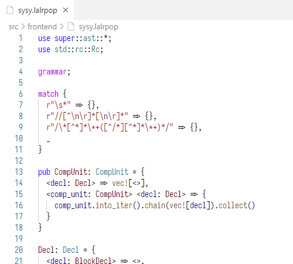
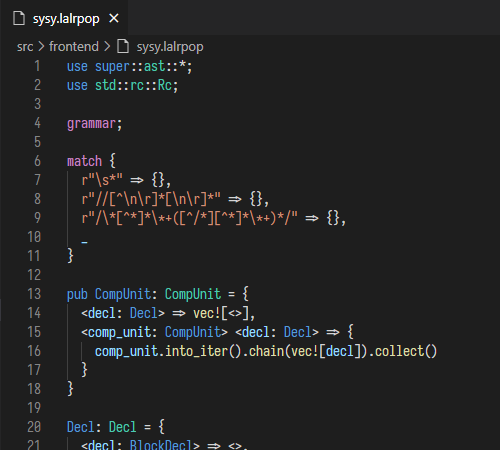

# LALRPOP syntax highlighting for VS Code

This extension provides highlighting for [LALRPOP](https://github.com/lalrpop/lalrpop), a Rust parser generator.

The majority of the grammar comes from [dustypomerleau/rust-syntax](https://github.com/dustypomerleau/rust-syntax), and some LALRPOP-specific syntax was added.

## Examples

Light

Dark

